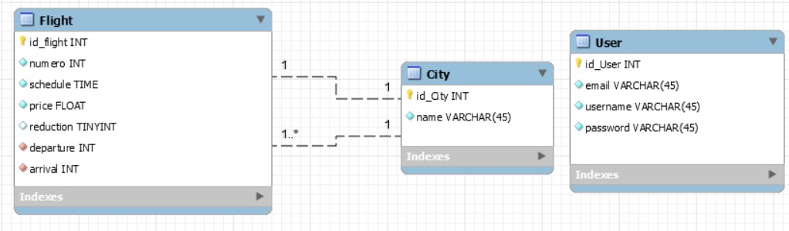

# 1. Capital Airways
- [1. Capital Airways](#1-capital-airways)
- [2. Analyse du projet](#2-analyse-du-projet)
  - [2.1. Analyse du projet](#21-analyse-du-projet)
  - [2.2. Analyse fonctionnelle](#22-analyse-fonctionnelle)
  - [2.3. Couche métier](#23-couche-métier)
    - [2.3.1. Dégager les types de données](#231-dégager-les-types-de-données)
  - [2.4. Modélisation de la DB](#24-modélisation-de-la-db)
- [3. Configuration de l'API](#3-configuration-de-lapi)
  - [3.1. Database](#31-database)
  - [3.2. Entity Flight / City & Relation](#32-entity-flight--city--relation)
  - [3.3. Fixtures](#33-fixtures)


# 2. Analyse du projet

## 2.1. Analyse du projet
Une cie de vols privés propose des trajets VIP vers des capitales européennes. 
Une API avec :
- Un système de login avec 2 types de users. `user` & `admin`.
- Un espace privé `admin` qui affiche des vols et propose des actions de type CRUD pour gérer les vols.

L'API à ce stade permet de gérer les vols de la journée en cours.

## 2.2. Analyse fonctionnelle
- A faire de même
- Compréhensible pour / dicté par le client.
- Peut donner lui à un **UseCase** UML

## 2.3. Couche métier

### 2.3.1. Dégager les types de données
  1. Vol || Trajet
  2. Capitale
  3. User

## 2.4. Modélisation de la DB
Avec MySQL workbench, on modélise un diagramme de class UML qui est basée sur l'analyse fonctionnelle.




# 3. Configuration de l'API
## 3.1. Database

Mettre en place dans le fichier .env le chemin vers la future db puis executer :

```bash
symfony console doctrine:database:create

```
## 3.2. Entity Flight / City & Relation

Mettre en place dans les Entity et faire les migrations :

```bash
symfony console make:entity
symfony console make:migration
symfony console doctrine:migration:migrate
```


## 3.3. Fixtures

J'importe le bundle nécessaire aux Fixtures :
composer require --dev doctrine/doctrine-fixtures-bundle

Puis je travail mes fixtures dans le dossier DataFixtures, AppFixtures, function `load()`. 

1.  Pour les villes, je décide de créer une liste des villes servies par la compagnie et de boucler dessus pour générer un Objet par ville et ses attributs. J'en profite pour stocker cet objet dans un Tableau d'objet des villes `$tabCityObj[] = $city;` :
 
 
 ```php
   $city = [
            'Paris',
            'Londres',
            'Madrid',
            'Amsterdam',
            'Rome',
            'Sofia'
        ];
    foreach ($city as $c) {
            $city = new City;
            $city->setName($c);
            $tabCityObj[] = $city;
            $manager->persist($city);
        }
 ```

2. Pour les vols, il y aura un n° de vol statique. J'instancie un vol `$flight1 = new Flight;` et je remplis ses attributs. 

```php
$flight1 = new Flight;
$flight1
    ->setNumero(2878)
    ->setSchedule(\DateTime::createFromFormat('h:i','00:00'))
    ->setPrice(490)
    ->setReduction(false)
    ->setDeparture($tabCityObj[1])
    ->setArrival($tabCityObj[3])
    ;
    $manager->persist($flight1);
```

3. **NOTION IMPORTANT** Les champs `departure` et `arrival` doivent être renseigné avec un objet pour faire le lien entre les deux tables. Elles font référence à la function suivante qui attend un objet `?City `:

```php
    public function setDeparture(?City $departure): self

```

Je le remplis avec `->setDeparture($tabCityObj[1])` qui fait référence à un des objets de mon tableau d'objet city créé precedemment.
 
